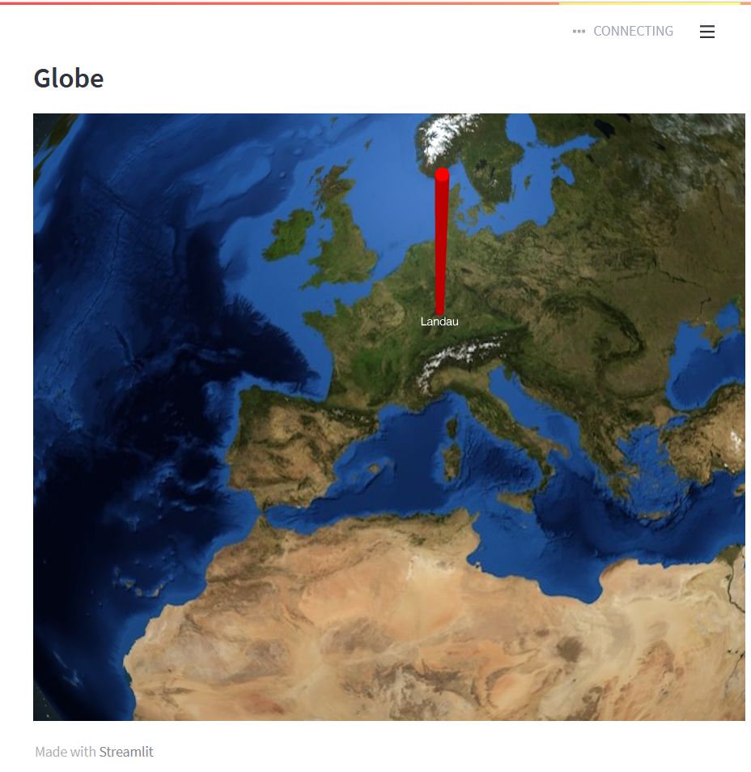

# streamlit_globe
Streamlit Globe is a wrapper around globe.gl and provides some simple data visualization functionality in Streamlit. In the current release points and labels are implemented.



## Usage
- You either have to provide pointsData or labelsData (or both) to render the globe.
- Watch out to create the correct object structure for both arrays.
- daytime parameter accepts 'day' or 'night'
- You have to provide a width and a height, this is not determined automatically by streamlit.

## Example usage
```import streamlit as st 
from streamlit_globe import streamlit_globe

st.subheader("Globe")
pointsData=[{'lat': 49.19788311472706, 'lng': 8.114625722364316, 'size': 0.3, 'color': 'red'}]
labelsData=[{'lat': 49.19788311472706, 'lng': 8.114625722364316, 'size': 0.3, 'color': 'red', 'text': 'Landau'}]
streamlit_globe(pointsData=pointsData, labelsData=labelsData, daytime='day', width=800, height=600)
```